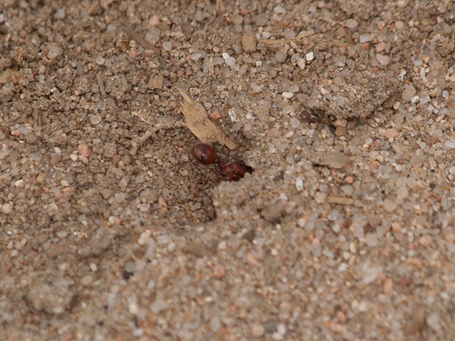
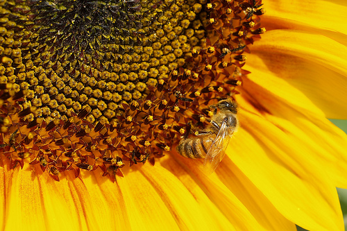

# Classification d'images : fourmis et abeilles

Ce projet applique le **transfer learning** avec PyTorch et Torchvision pour
classer des images de fourmis (*ants*) et d'abeilles (*bees*). Le script
principal est [transfert_learning_ants_bees.py](transfert_learning_ants_bees.py).

Après avoir appris à réaliser cet exemple avec les fourmis et les abeilles à
partir de la documentation de PyTorch, j'ai souhaité m'amuser à créer une
détection d'images capable de reconnaître des personnes sur une photo.

## Exemples d'images

| Fourmi | Abeille |
| --- | --- |
|  |  |

## Fonctionnement

Le script :

1. télécharge et décompresse automatiquement le dataset Hymenoptera s'il est absent ;
2. charge les ensembles `train` et `val` avec `ImageFolder` ;
3. transforme les images pour ResNet-18 : recadrage en `224 x 224`, augmentation
   aléatoire pour l'entraînement et normalisation ImageNet pour les deux ensembles ;
4. entraîne deux modèles ResNet-18 pré-entraînés sur ImageNet :
   - **fine-tuning** : toutes les couches sont entraînées ;
   - **feature extractor** : les couches pré-entraînées sont gelées et seule
     la couche finale est entraînée ;
5. affiche la `Loss` et l'accuracy (`Acc`) pour l'entraînement et la validation ;
6. affiche des prédictions sur des images de validation et sur une image de test.

## Prérequis

- Python 3.9 ou version ultérieure ;
- un environnement virtuel Python ;
- les dépendances de [requirements.txt](requirements.txt).

Le script utilise l'accélérateur disponible : CUDA, MPS sur les Mac Apple
Silicon, ou CPU. Le dataset et les poids pré-entraînés de ResNet-18 sont
téléchargés au premier lancement.

## Installation

Depuis le dossier du projet :

```bash
python3 -m venv .venv
source .venv/bin/activate
python -m pip install -r requirements.txt
```

L'environnement `.venv` existe déjà ? Il suffit de l'activer dans chaque
nouvelle session de terminal :

```bash
source .venv/bin/activate
```

Dans VS Code, sélectionnez l'interpréteur `.venv/bin/python` avec la commande
**Python: Select Interpreter**.

## Exécution

```bash
source .venv/bin/activate
python transfert_learning_ants_bees.py
```

Le premier lancement nécessite une connexion Internet. Le script place le
dataset à côté de lui et ignore le téléchargement si `hymenoptera_data/`
existe déjà.

```text
transfert-learning/
├── transfert_learning_ants_bees.py
├── requirements.txt
├── README.md
├── images/
│   ├── fourmi.jpg
│   └── abeille.jpg
├── hymenoptera_data/
│   ├── train/
│   │   ├── ants/
│   │   └── bees/
│   └── val/
│       ├── ants/
│       └── bees/
└── .venv/
```

Le dataset est téléchargé depuis :
`https://download.pytorch.org/tutorial/hymenoptera_data.zip`.

## Paramètres principaux

Les paramètres sont définis directement dans
[transfert_learning_ants_bees.py](transfert_learning_ants_bees.py) :

| Paramètre | Valeur | Rôle |
| --- | ---: | --- |
| Taille des lots | `4` | Images traitées par lot |
| Nombre d'époques | `25` | Durée de chaque entraînement |
| Taux d'apprentissage | `0.001` | Pas de l'optimiseur SGD |
| Momentum | `0.9` | Paramètre de SGD |
| Scheduler | `StepLR` | Réduction tous les `7` époques par `0.1` |
| Workers | `0` | Compatible avec macOS et MPS |

Le meilleur état de chaque modèle est conservé temporairement selon
l'accuracy de validation, puis rechargé à la fin de l'entraînement. Aucun
modèle n'est enregistré dans un fichier permanent.

## Résultats d'entraînement

Résultats obtenus après `25` époques sur le dataset de validation :

| Méthode | Meilleure accuracy de validation | Durée |
| --- | ---: | ---: |
| Fine-tuning de ResNet-18 | **94,77 %** | 2 min 33 s |
| ResNet-18 comme feature extractor | **94,77 %** | 1 min 12 s |

Les deux méthodes obtiennent le même meilleur score de validation. Le mode
**feature extractor** est toutefois plus rapide, car les couches pré-entraînées
restent gelées et seule la couche finale est optimisée.

Pour le fine-tuning, la meilleure accuracy est atteinte aux époques `17` et
`19`. Pour le feature extractor, elle est atteinte à plusieurs époques, dont
`10`, `12`, `13`, `15`, `18`, `19`, `20` et `24`.

## Tester une autre image

À la fin du script, l'image de validation utilisée est définie ici :

```python
visualize_model_predictions(
    model_conv,
   img_path=data_dir / 'val' / 'bees' / '2501530886_e20952b97d.jpg'
)
```

Pour tester une autre image, remplacez ce chemin par celui d'une image lisible
par Pillow. La prédiction est affichée après les deux entraînements.

## Second projet : personnes célèbres

Le script [transfert_learning_famous.py](transfert_learning_famous.py) applique
le même principe de transfer learning à cinq classes de visages :

```text
bill_gates
elon_musk
jeff_bezos
mark_zuckerberg
steve_jobs
```

### Exemples d'images

| Bill Gates | Elon Musk | Jeff Bezos |
| --- | --- | --- |
|  |  |  |

| Mark Zuckerberg | Steve Jobs |
| --- | --- |
|  |  |

Le dataset Kaggle est téléchargé automatiquement avec
[famous_dataset_import.py](famous_dataset_import.py), puis placé dans :

```text
famous_people_dataset/data/
├── train/
└── valid/
```

Le script fait correspondre le dossier réel `valid` avec le nom interne `val` :

```python
split_dirs = {
   'train': 'train',
   'val': 'valid',
}
```

Pour lancer ce second projet :

```bash
.venv/bin/python transfert_learning_famous.py 2>&1 | tee resultat.txt
```

Il entraîne deux modèles ResNet-18 pendant `5` époques : un modèle en
fine-tuning et un modèle utilisé comme feature extractor. Les meilleurs poids
sont conservés dans `models/` et rechargés lors des exécutions suivantes ; le
réentraînement n'est donc pas relancé si les fichiers existent déjà.

La fonction `visualize_random_validation_images` choisit aléatoirement une
image dans chaque classe du dossier `valid` et affiche la classe réelle ainsi
que la classe prédite.

### Résultats mesurés

Les modèles sauvegardés ont été évalués sur les `914` images de l'ensemble
`valid` :

| Modèle | Prédictions correctes | Accuracy |
| --- | ---: | ---: |
| Fine-tuning ResNet-18 | `895 / 914` | **97,92 %** |
| Feature extractor ResNet-18 | `521 / 914` | **57,00 %** |

Dans cette évaluation, le fine-tuning est nettement meilleur. Le feature
extractor, qui ne met à jour que la dernière couche, aurait besoin d'un
entraînement plus long ou de réglages supplémentaires.

### L'écart énorme entre les deux modèles est suspect, mais explicable

- **Fine-tuning (97,92 %)** : tout le réseau a pu s'adapter aux caractéristiques
   spécifiques de ce dataset (résolution, cadrage, luminosité et style des
   photos). Un score très élevé sur le **même type de données** que celui vu en
   entraînement est cohérent avec un modèle qui a bien mémorisé les spécificités
   visuelles de *ce* dataset précis, mais ne garantit pas une vraie capacité de
   reconnaissance faciale généraliste.
- **Feature extractor (57 %)** : ce score est bien plus bas, ce qui est logique.
   Seule la dernière couche a pu s'adapter ; le reste du réseau reste figé sur
   des représentations génériques d'ImageNet (objets et textures), qui ne sont
   pas spécifiquement optimisées pour distinguer des visages entre eux. `57 %`
   reste **nettement au-dessus du hasard** (`20 %` pour cinq classes) : le modèle
   apprend donc quelque chose de réel, mais de façon beaucoup moins fine.

### Ce contraste doit être vérifié sur LFW

Si le score de `97,92 %` du fine-tuning s'effondre fortement sur LFW, par
exemple vers `60-70 %` ou moins, cela confirmerait que ce résultat est en
grande partie dû à un **surapprentissage des spécificités du dataset Kaggle**,
plutôt qu'à une véritable capacité de reconnaissance faciale généralisable.
À l'inverse, si le feature extractor (`57 %`) reste stable sur LFW, cela
indiquerait qu'il généralise mieux malgré un score brut plus faible.

En résumé, ces résultats ne sont ni « bons » ni « mauvais » dans l'absolu :
ils sont incomplets. Le vrai test de fiabilité est la comparaison avec LFW,
qui permettra d'évaluer les modèles `model_ft` et `model_conv` sauvegardés sur
des visages provenant d'un autre dataset.

À ce stade, je n'ai pas encore effectué l'entraînement ni la validation sur
LFW. Il est toutefois important de réaliser cette étape afin de vérifier si
les modèles généralisent correctement et si les résultats obtenus sur le
dataset Kaggle sont réellement fiables.

## Qu'est-ce que LFW et comment l'obtenir ?

**LFW** (*Labeled Faces in the Wild*) est un dataset public de visages pris
dans des conditions réelles : éclairages, expressions, cadrages et arrière-plans
variés. Il est souvent utilisé pour tester la généralisation d'un modèle de
reconnaissance ou de vérification faciale. Il contient plus de `13 000` images
de plus de `5 000` personnes.

LFW est différent du dataset Kaggle utilisé ici : ses personnes et ses labels
ne correspondent pas directement aux cinq classes `bill_gates`, `elon_musk`,
`jeff_bezos`, `mark_zuckerberg` et `steve_jobs`. Il ne suffit donc pas de
remplacer le dossier `valid` par LFW ; il faut préparer une évaluation adaptée
ou utiliser LFW pour une tâche de vérification faciale.

Pour télécharger LFW automatiquement, installer `scikit-learn` :

```bash
.venv/bin/python -m pip install scikit-learn
```

Puis exécuter :

```python
from sklearn.datasets import fetch_lfw_people

lfw = fetch_lfw_people(
   min_faces_per_person=20,
   resize=0.4,
   color=True
)

print("Images LFW :", lfw.images.shape[0])
print("Classes LFW :", len(lfw.target_names))
print("Dataset stocké dans le cache scikit-learn.")
```

Le premier téléchargement nécessite une connexion Internet. Les fichiers sont
ensuite conservés dans le cache local de scikit-learn et ne sont pas ajoutés
au dépôt Git.

## Fichiers ignorés

[.gitignore](.gitignore) exclut notamment l'environnement virtuel, le dataset,
les archives ZIP, les poids de modèles et les caches Python.

---

# Image Classification: Ants and Bees

This project uses **transfer learning** with PyTorch and Torchvision to
classify images of ants and bees. The main script is
[transfert_learning_ants_bees.py](transfert_learning_ants_bees.py).

After learning how to build this ants-and-bees example from the PyTorch
documentation, I wanted to experiment by creating an image recognition system
that can recognize people in a photo.

## Image Examples

| Ant | Bee |
| --- | --- |
|  |  |

## How It Works

The script:

1. automatically downloads and extracts the Hymenoptera dataset if it is missing;
2. loads the `train` and `val` sets with `ImageFolder`;
3. transforms the images for ResNet-18: `224 x 224` crops, random augmentation
   for training, and ImageNet normalization for both sets;
4. trains two ImageNet-pre-trained ResNet-18 models:
   - **fine-tuning**: all layers are trained;
   - **feature extractor**: pre-trained layers are frozen and only the final
     layer is trained;
5. displays `Loss` and accuracy (`Acc`) for training and validation;
6. displays predictions for validation images and one test image.

## Requirements

- Python 3.9 or later;
- a Python virtual environment;
- the dependencies listed in [requirements.txt](requirements.txt).

The script uses the available accelerator: CUDA, MPS on Apple Silicon Macs,
or CPU. The dataset and ResNet-18 pre-trained weights are downloaded on the
first run.

## Installation

From the project directory:

```bash
python3 -m venv .venv
source .venv/bin/activate
python -m pip install -r requirements.txt
```

If `.venv` already exists, activate it at the start of each new terminal
session:

```bash
source .venv/bin/activate
```

In VS Code, select `.venv/bin/python` with **Python: Select Interpreter**.

## Running the Script

```bash
source .venv/bin/activate
python transfert_learning_ants_bees.py
```

The first run requires an Internet connection. The script stores the dataset
next to itself and skips the download if `hymenoptera_data/` already exists.

The dataset is downloaded from:
`https://download.pytorch.org/tutorial/hymenoptera_data.zip`.

## Main Parameters

The parameters are defined directly in
[transfert_learning_ants_bees.py](transfert_learning_ants_bees.py):

| Parameter | Value | Purpose |
| --- | ---: | --- |
| Batch size | `4` | Images processed in each batch |
| Number of epochs | `25` | Duration of each training run |
| Learning rate | `0.001` | SGD optimizer step size |
| Momentum | `0.9` | SGD parameter |
| Scheduler | `StepLR` | Reduces the rate every `7` epochs by `0.1` |
| Workers | `0` | Compatible with macOS and MPS |

The best state of each model is temporarily saved according to validation
accuracy, then reloaded at the end of training. No model is saved permanently.

## Training Results

Results obtained after `25` epochs on the validation dataset:

| Method | Best validation accuracy | Duration |
| --- | ---: | ---: |
| ResNet-18 fine-tuning | **94.77%** | 2 min 33 sec |
| ResNet-18 as a feature extractor | **94.77%** | 1 min 12 sec |

Both methods reached the same best validation score. The **feature extractor**
approach was faster because the pre-trained layers remained frozen and only the
final layer was optimized.

For fine-tuning, the best accuracy was reached at epochs `17` and `19`. For the
feature extractor, it was reached at several epochs, including `10`, `12`,
`13`, `15`, `18`, `19`, `20`, and `24`.

## Testing Another Image

At the end of the script, the validation image is selected here:

```python
visualize_model_predictions(
    model_conv,
    img_path=data_dir / 'val' / 'bees' / '2501530886_e20952b97d.jpg'
)
```

To test another image, replace this path with the path to an image readable by
Pillow. The prediction is displayed after both training runs.

## Second Project: Famous People

The [transfert_learning_famous.py](transfert_learning_famous.py) script applies
the same transfer learning approach to five face classes:

```text
bill_gates
elon_musk
jeff_bezos
mark_zuckerberg
steve_jobs
```

### Image Examples

| Bill Gates | Elon Musk | Jeff Bezos |
| --- | --- | --- |
|  |  |  |

| Mark Zuckerberg | Steve Jobs |
| --- | --- |
|  |  |

The Kaggle dataset is downloaded automatically by
[famous_dataset_import.py](famous_dataset_import.py) and stored in:

```text
famous_people_dataset/data/
├── train/
└── valid/
```

The script maps the actual `valid` folder to the internal `val` name:

```python
split_dirs = {
   'train': 'train',
   'val': 'valid',
}
```

Run this second project with:

```bash
.venv/bin/python transfert_learning_famous.py 2>&1 | tee resultat.txt
```

It trains two ResNet-18 models for `5` epochs: one with fine-tuning and one as
a feature extractor. The best weights are stored in `models/` and loaded on
subsequent runs, so training is skipped when those files already exist.

The `visualize_random_validation_images` function randomly selects one image
from each class in `valid` and displays its actual and predicted classes.

### Measured Results

The saved models were evaluated on the `914` images in the `valid` set:

| Model | Correct predictions | Accuracy |
| --- | ---: | ---: |
| ResNet-18 fine-tuning | `895 / 914` | **97.92%** |
| ResNet-18 feature extractor | `521 / 914` | **57.00%** |

In this evaluation, fine-tuning performed significantly better. The feature
extractor, which updates only the final layer, would need longer training or
additional tuning.

### The Large Gap Between the Two Models Is Suspicious but Explainable

- **Fine-tuning (97.92%)**: the entire network was able to adapt to the specific
   characteristics of this dataset, including resolution, framing, lighting,
   and photo style. A very high score on the **same type of data** seen during
   training is consistent with a model that has memorized the visual properties
   of *this* specific dataset, but it does not necessarily demonstrate general
   face-recognition ability.
- **Feature extractor (57%)**: this much lower score is understandable because
   only the final layer was allowed to adapt. The rest of the network remains
   frozen with generic ImageNet representations (objects and textures), which
   are not specifically optimized to distinguish between faces. `57%` is still
   **well above chance** (`20%` for five classes), so the model is learning
   something real, just much less precisely.

### This Contrast Should Be Tested on LFW

If the fine-tuning score of `97.92%` drops sharply on LFW, for example to
`60-70%` or lower, this would confirm that the result is largely caused by
**overfitting to the specific characteristics of the Kaggle dataset**, rather
than by genuine generalizable face-recognition ability. Conversely, if the
feature extractor (`57%`) remains stable on LFW, it would indicate better
generalization despite its lower raw score.

In summary, these results are neither simply "good" nor "bad": they are
incomplete. The real reliability test is the comparison with LFW, which will
evaluate the saved `model_ft` and `model_conv` models on faces from a different
dataset.

At this stage, I have not yet trained or validated the models on LFW. However,
performing this step is important to check whether the models generalize
correctly and whether the results obtained on the Kaggle dataset are genuinely
reliable.

## What Is LFW and How to Get It?

**LFW** (*Labeled Faces in the Wild*) is a public face dataset collected in
real-world conditions, with varied lighting, expressions, framing, and
backgrounds. It is commonly used to test the generalization of face-recognition
or face-verification models. It contains more than `13,000` images of more than
`5,000` people.

LFW is different from the Kaggle dataset used here: its people and labels do
not directly match the five classes `bill_gates`, `elon_musk`, `jeff_bezos`,
`mark_zuckerberg`, and `steve_jobs`. Therefore, LFW cannot simply replace the
`valid` folder; an adapted evaluation must be prepared, or LFW must be used for
a face-verification task.

To download LFW automatically, install `scikit-learn`:

```bash
.venv/bin/python -m pip install scikit-learn
```

Then run:

```python
from sklearn.datasets import fetch_lfw_people

lfw = fetch_lfw_people(
   min_faces_per_person=20,
   resize=0.4,
   color=True
)

print("LFW images:", lfw.images.shape[0])
print("LFW classes:", len(lfw.target_names))
print("Dataset stored in the scikit-learn cache.")
```

The first download requires an Internet connection. The files are then kept
in scikit-learn's local cache and are not added to the Git repository.

## Ignored Files

[.gitignore](.gitignore) excludes the virtual environment, dataset, ZIP
archives, model weights, and Python caches.